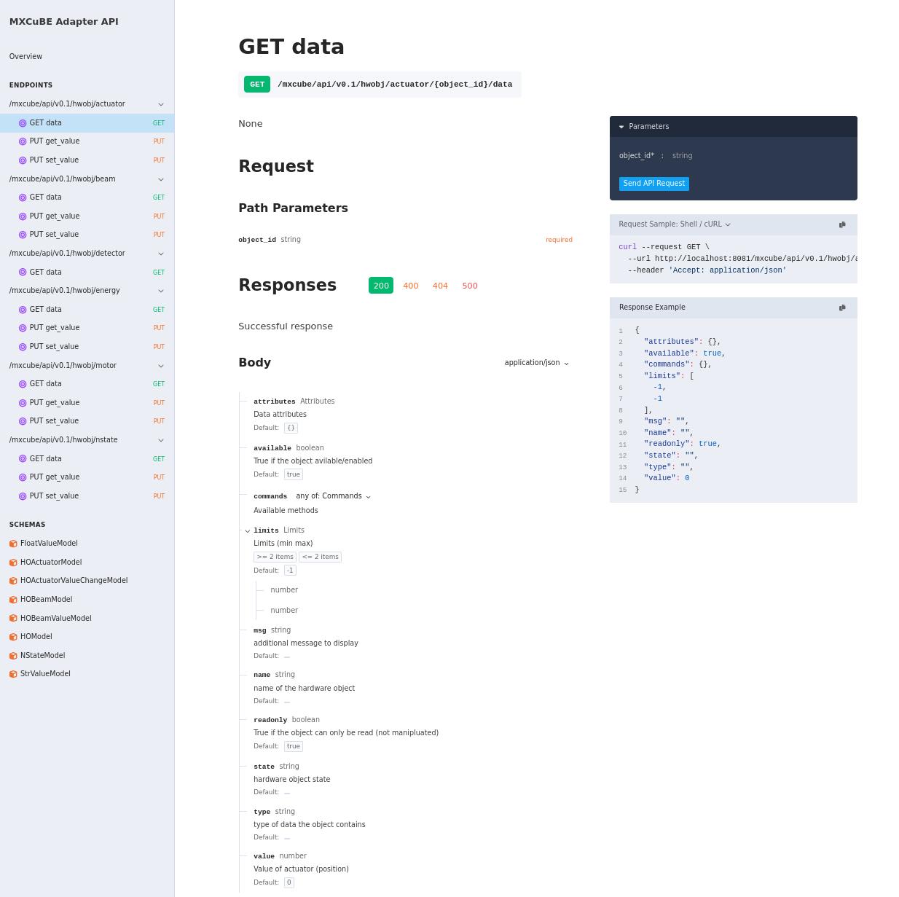

# HardwareObject Adapters

A **HardwareObject adapter** adapts or translates essential methods and signals/events from a `HardwareObject` so it can be used in a web application. A JSON representation of the `HardwareObject`, or parts of it, is transferred to the web application during initialization or on request. A method called `data` is responsible for returning the JSON representation of the HardwareObject.

## JSON Representation

All adapter objects are serializable to JSON via their `data()` method. Adapters inheriting from `BaseAdapter` return an object with the following fields:

- **`name`**: Unique object name.
- **`state`**: Current state (e.g., `READY`, `BUSY`), based on the `HardwareObject` state.
- **`msg`**: A descriptive message, if applicable.
- **`type`**: Object type (e.g., `"motor"`).
- **`available`**: Whether the object is online.
- **`readonly`**: Whether the object is read-only.
- **`commands`**: A list of executable commands.
- **`attributes`**: A dictionary object with readable attributes (key, value).

### Actuator Adapters

Adapters inheriting from `ActuatorAdapterBase` also include:

- **`value`**: The current actuator value.
- **`limits`**: A tuple defining the allowed limits.

## Event handling

Event data are sent over websockets. There is currently support for updating:

- An entire HardwareObject by emitting **`emit_ho_changed`**
- The value of an AbstractActuator HardwareObject by emitting **`emit_ho_value_changed`**
- An arbitrary attribute contained in the **`attribues`** object by emitting **`emit_ho_attribute_changed`**

The hardware object signals **`valueChanged`** and **`stateChanged`** need to be handled by the adapter
for the state and the value of the hardware object to be updated correctly. The handlers of each signal can
be overridden to add additional treatment of the signal but should in the end call `AdapterBase.value_change` and `AdapterBase.state_change` respectively.

_Example of signal handling:_

```python
class ActuatorAdapter(ActuatorAdapterBase):
    """
    Adapter for Energy Hardware Object, a web socket is used to communicate
    information on longer running processes.
    """

    SUPPORTED_TYPES: ClassVar[list[object]] = [AbstractActuator.AbstractActuator]

    def __init__(self, ho, role, app, resource_handler_config=resource_handler_config):
        """
        Args:
            ho (object): Hardware object.
        """
        super().__init__(ho, role, app, resource_handler_config)

        ho.connect("valueChanged", self._value_change)
        ho.connect("stateChanged", self.state_change)
```

```{attention}
The mapping of the events/signals to handler is for the time being done by code but a more configurable solution that supports a mapping similar to the one for HTTP endpoints are being developed.
```

## Supported Types

Adapters specify the `HardwareObject` types they support using the `SUPPORTED_TYPES` class variable. For example, the `MotorAdapter` supports all objects that inherit from `AbstractMotor`:

```python
class MotorAdapter(ActuatorAdapterBase):
    SUPPORTED_TYPES: ClassVar[list[object]] = [AbstractMotor.AbstractMotor]

    def __init__(self, ho, role, app):
        ...
```

Subclasses can override `SUPPORTED_TYPES` to narrow down or change the supported types. For example, a base class may support `AbstractActuator` like `ActuatorAdapterBase`, while a subclass can specialize `AbstractMotor` like above. The list can contain multiple types and does not need to include abstract classes.

## HTTP Resource/endpoint definition

Adapter methods and properties can be exposed as HTTP endpoints using the `AdapterResourceHandler`. For each exported method or property, a corresponding endpoint is created and attached to the server.

## Input & Output Validation

- **Input**: Passed arguments are validated and converted to either a single Pydantic model or a native type (`str`, `int`, `float`, or `bool`).

  - Strings are sanitized to allow only alphanumeric characters, dot (`.`), hyphen (`-`), and underscore (`_`).

- **Output**: Must be one of:
  - A Pydantic model
  - A dictionary-like object implementing `__dict__`
  - A native type (`str`, `int`, `float`, `bool`, or `list`)

Returned data is serialized to JSON before being sent.

## Endpoint to method mapping configuration

Exports, endpoint-mapping, are defined in a list of dictionaries with the following format:

```python
exports = [
    {"attr": "get_value", "method": "PUT", "decorators": []}
]
```

- **`attr`**: Name of the method or property on the adapter.
- **`method`**: HTTP verb to use (`GET`, `PUT`, `POST`, etc.).
- **`decorators`**: A list of decorator functions to apply to the view.

### Convenience Structures

Two convenience structures are supported to reduce redundancy: `commands` and `attributes`.

#### Commands

A list of method names to export as HTTP `PUT` endpoints with default decorators `[restrict, require_control]`. For example:

```python
commands = ["set_value", "get_value"]
```

This generates:

```python
[
    {"attr": "set_value", "method": "PUT", "decorators": [restrict, require_control]},
    {"attr": "get_value", "method": "PUT", "decorators": [restrict, require_control]},
]
```

#### Attributes

A list of property names to export as HTTP `GET` endpoints with no decorators by default. For example:

```python
attributes = ["data"]
```

This generates:

```python
[
    {"attr": "data", "method": "GET", "decorators": []}
]
```

## Example Configuration

Below is an example of how to define a resource handler configuration for a `MotorAdapter`:

```python
from mxcubeweb.core.models.configmodels import ResourceHandlerConfigModel

resource_handler_config = ResourceHandlerConfigModel(
    commands=[
        "set_value",
        "get_value",
    ],
    attributes=["data"],
)

class MotorAdapter(ActuatorAdapterBase):
    SUPPORTED_TYPES: ClassVar[list[object]] = [AbstractMotor.AbstractMotor]

    def __init__(self, ho, role, app):
        """
        Args:
            ho (object): The underlying HardwareObject.
        """
        super().__init__(ho, role, app, resource_handler_config)
```

This setup:

- Exposes `set_value` and `get_value` methods as `PUT` endpoints
- Exposes the `data` property as a `GET` endpoint

## OpenAPI specification genereation

The ResourceHandler uses a helper class to generate a OpenAPI specification that is serverd by the server on
`/apidocs/openapi.json`. There are a number of user-friendly web applications for viewing and testing the endpoints in a OpenAPI specification. There is currently support for the **redoc**, **swagger** and **elements** projects that are all different ways of displaying the OpenAPI specification. They can be accessed via:

- `/apidocs/docs_redoc`
- `/apidocs/docs_swagger`
- `/apidocs/docs_elements`

_Example of using redoc to display the OpenAPI Spec_

